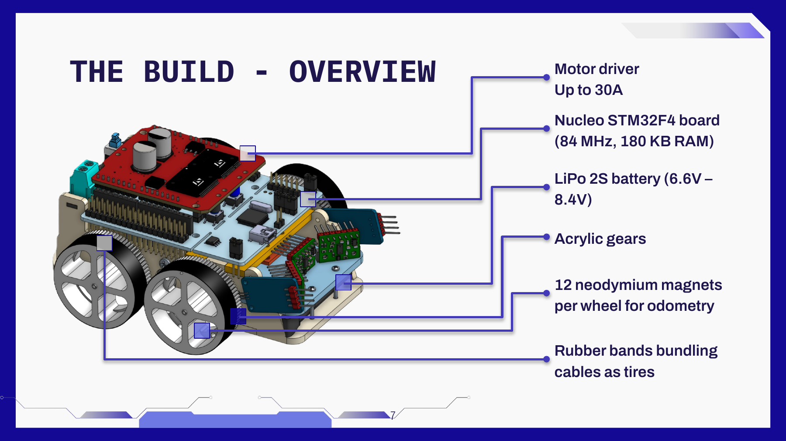
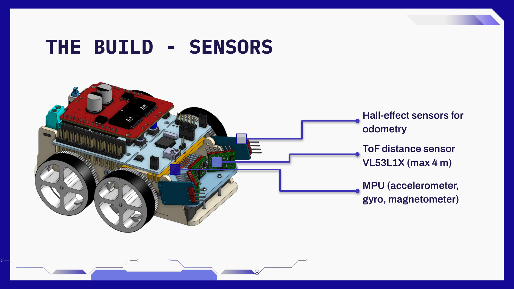
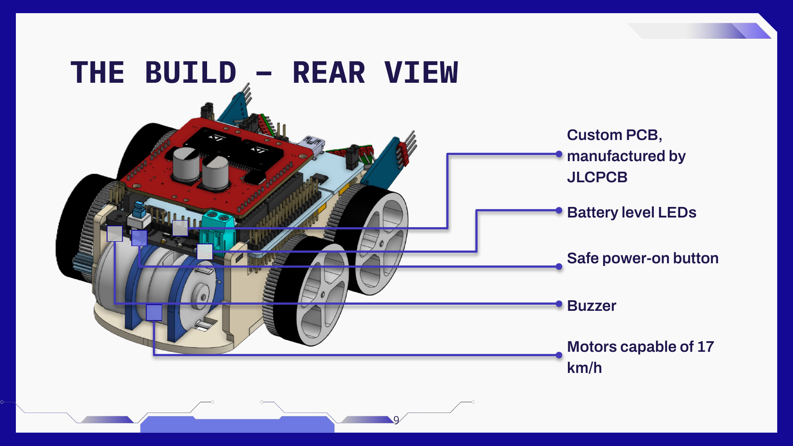
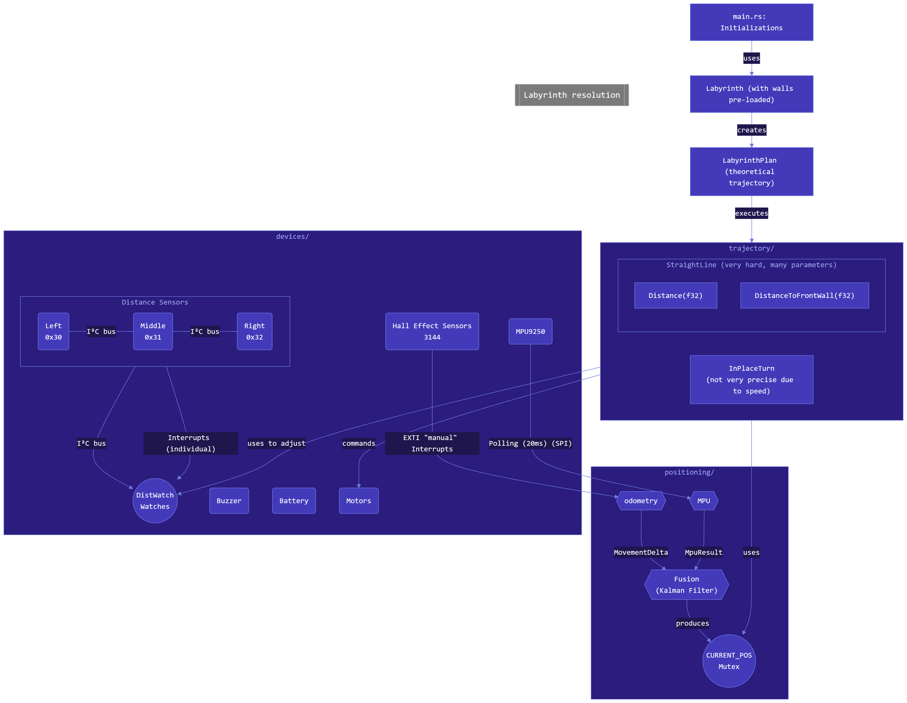

# [Bananasmoothii's Micromouse](https://github.com/bananasmoothii/micromouse)


A school project aiming to make a Micromouse robot and make it solve a maze (with official-size cells: 18x18 cm).

## Flash and run code

Install [Rust](https://doc.rust-lang.org/cargo/getting-started/installation.html) and [probe-rs](https://probe.rs/)
with one of the methods in their docs. Then plug the STM32F446RE Nucleo board via USB and flash and run with:

```sh
cargo run
```

(configured in `./.cargo`)

The robot has a power mechanism that cuts power when battery isn't charged enough, but this requires you to
maintain the button (on the back custom PCB) pressed when flashing the MCU. I recommend having an IDE keyboard
shortcut for this command. Flashing often fails on the first try, if it does just try again.

## Hardware used

* Nucleo board (with ST-Link): MCU is STM32F446RE
* Monster Moto shield
*
Two [IGARASHI N 2738-45 motors](https://www.conrad.fr/fr/p/moteur-universel-a-balais-brushed-igarashi-2738-048-gfc-3-244503.html)
*
One [LiPo 2S battery](https://www.conrad.fr/fr/p/reely-pack-de-batterie-lipo-7-4-v-350-mah-nombre-de-cellules-2-25-c-softcase-bec-2617149.html)
(6V - 8.4V) (bought two for using one while the other charges)
* Two 3144 Hall sensors (magnet → `DOUT = HIGH`) for odometry (12 magnets per wheel)
* One MPU 9250 (accelerometer + gyroscope + magnetometer + temperature sensor)
* Three VL53L1X distance sensors
* Tires are made from [20x7mm elastics](https://www.amazon.fr/dp/B0D9K3PJJF)
* [Cylindrical magnets, 2mm wide](https://www.amazon.fr/dp/B08NDRXGQX)

## [CAD models](https://cad.onshape.com/documents/aaf7a6983651c7702bceaa13/w/41b76918edb6f00955c96fe0/e/62dd90809362918a445464ef?renderMode=0&uiState=6a1494e0c7839ab38c881d4a)

This repo contains almost everything related to this project except the CAD models in the Onshape link above.

* The chassis is laser-cut from 3mm-thick wood and assembled with wood glue for the most stressed parts
* The wheels are made of laser-cut acrylic (wood not being resistant enough for gearing) pieces superglued together

  Note: In Onshape, the wheels are solid, you need the **Kiri:Moto** plugin to slice in 5mm slices and export as SVG for
  the laser cutter.
* The shafts are shoulder screws (unthreaded shoulder acting as the axle) screwed directly into the wooden chassis
* The smallest gear that's directly on the motors' shaft are metal, bought them
  [here](https://www.conrad.fr/fr/p/acier-roue-a-denture-frontale-reely-type-de-module-0-5-o-de-percage-2-3-mm-nombre-de-dents-12-240354.html)
* Kerf compensation was set to **0.16mm** for me (set in Kiri:Moto)

## Build & assembly manual

A full step-by-step guide to cutting the chassis, assembling the mechanics, and mounting all
electronics is available in
[issues_and_knowledge/build_manual.md](issues_and_knowledge/build_manual.md).

### Robot overview





## Custom PCB

Files for the custom pcb are in the `pcb` folder and can be opened with [KiCad](https://www.kicad.org/).

### Export for manufacturing with JLCPCB

I used JLCPCB to manufacture and assemble the PCB. For generating the production files, install this KiCad plugin:

> **Fabrication Toolkit**
>
> Toolkit for automating PCB fabrication process with KiCad and JLC PCB.
>
> Features:
> - Generates gerber files in correct format for production.
> - Generates BOM file in correct format for production.
> - Generates Pick and Place file in correct format for assembly.
> - Automatic and manual component translations.
> - Many more unique additional features.

Production files will be generated in `pcb/production`. The files you're gonna need for JLCPCB are:

- `pcb.zip` (contains the Gerber files)

And for PCB assembly (PCBA):

- `bom.csv` (Bill Of Materials)
- `positions.csv` as "CPL" (Component Placement List)

## Repository structure

**For more information, see [architecture.md](issues_and_knowledge/architecture.md)**



```
micromouse/
├── src/
│   ├── main.rs                   — Embassy entry point: heap init, peripheral setup, task spawning
│   ├── dimensions.rs             — Physical constants (cell size, wall thickness, wheel geometry)
│   ├── i2c_devices.rs            — Sequential XSHUT-based I2C init for the 3 ToF sensors
│   ├── flash_log.rs              — For storing logs in flash memory
│   ├── labyrinth.rs              — 16×16 maze grid, probabilistic wall detection, pathfinding (flood-fill)
│   ├── utils.rs                  — Shared utilities
│   ├── panic_handler.rs          — Custom panic handler (logs then halts)
│   │
│   ├── devices/                  — Hardware drivers
│   │   ├── motors.rs             — DC motor PI feedback loop, reads waypoints from PATH_CHANNEL
│   │   ├── hall_sensor_3144.rs   — Interrupt-driven wheel encoders (AtomicI32 tick counters)
│   │   ├── mpu9250.rs            — 9-DOF IMU over SPI (accel, gyro, magnetometer)
│   │   ├── battery.rs            — 2-cell LiPo voltage monitoring via ADC
│   │   ├── buzzer.rs             — PWM audio (TIM2), command channel-driven
│   │   └── vl53lxx/              — ToF distance sensors
│   │       ├── vl53l0x.rs        — VL53L0X driver (unused, kept for reference)
│   │       └── vl53l1x.rs        — VL53L1X driver (distance sensors, runtime I2C address change)
│   │
│   ├── positioning/              — Sensor fusion and position tracking
│   │   ├── mod.rs                — positioning_task: 20 ms sensor-fusion loop
│   │   ├── odometry.rs           — Skid-steering wheel kinematics
│   │   ├── mpu.rs                — Gyro → yaw, magnetometer → absolute heading
│   │   ├── fusion.rs             — Kalman Filter (odometry + gyro + magnetometer)
│   │   └── types.rs              — Position2D, MovementDelta
│   │
│   └── trajectory/               — Path planning and motion profiling
│       ├── mod.rs                — Converts cell path → smooth velocity-profiled segments
│       ├── straight_line.rs      — Straight segment with trapezoidal velocity profile
│       └── in_place_turn.rs      — In-place rotation segment
│
├── docs/                         — Hosted on https://bananasmoothii.github.io/micromouse/
│   └── timeline/                 — Project timeline web app (photos, videos, notes)
│
├── pcb/                          — KiCad files for the custom PCB
│   └── production/               — JLCPCB production and assembly files
│
├── issues_and_knowledge/         — Notes on hardware quirks, bugs, and build documentation
│   ├── architecture.md           — High-level architecture overview
│   ├── build_manual.md           — Step-by-step build & assembly manual (translated from Rapport.docx)
│   ├── build_manual/             — Images referenced by build_manual.md
│   ├── embassy_exti_missed_ticks_fix.md
│   ├── i2c_registers_and_pullups_explained.md
│   ├── monster moto shield ressources.md
│   └── vl53l1x_i2c_bsy_lockup_recovery.md
│
├── tools/                        — Various python scripts for analyzing logs with graphs or other things
│   └── clean_svg.py              — Replaces polyline-approximated circles in Kiri:Moto SVG exports with true SVG circles (fixes laser cutter charring)
│
├── build.rs                      — Build script (linker script selection)
├── Cargo.toml                    — Dependencies and patch section for forked sensor crates
├── memory.x                      — Linker memory map for STM32F446RE
└── .cargo/config.toml            — Default target (thumbv7em-none-eabi), runner (probe-rs), log level
```