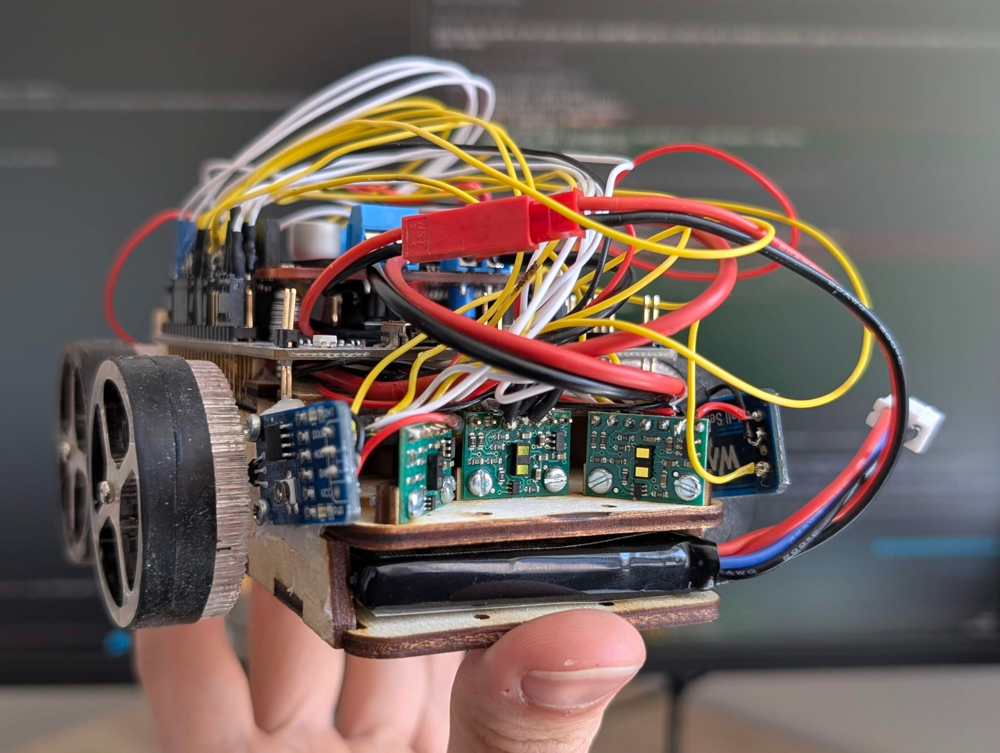

# [Micromouse](https://github.com/bananasmoothii/micromouse)



A school project aiming to make a Micromouse robot and make it solve a maze.

This repo contains almost everything related to this project except the
[**CAD models
**](https://cad.onshape.com/documents/aaf7a6983651c7702bceaa13/w/41b76918edb6f00955c96fe0/e/62dd90809362918a445464ef)

## Hardware used

* Nucleo board (with ST-Link): MCU is STM32F446RE
* Monster Moto shield
* Two IGARASHI N 2738-45 motors
* One LiPo 2S battery (6,6V - 8.4V)
* Two 3144 Hall sensors (magnet → `DOUT = HIGH`) for odometry (12 magnets per wheel)
* One MPU 9250 (accelerometer + gyroscope + magnetometer + temperature sensor)
* Three VL53L1X distance sensors

## Flash and run code

```sh
cargo run
```

The robot has a power mechanism that cuts power when battery isn't measured to be enough, but this requires you to
maintain the button (on the back custom PCB) pressed when flashing the MCU. I recommend having an IDE keyboard
shortcut for this command. Flashing often fails on the first try, if it does just try again.
