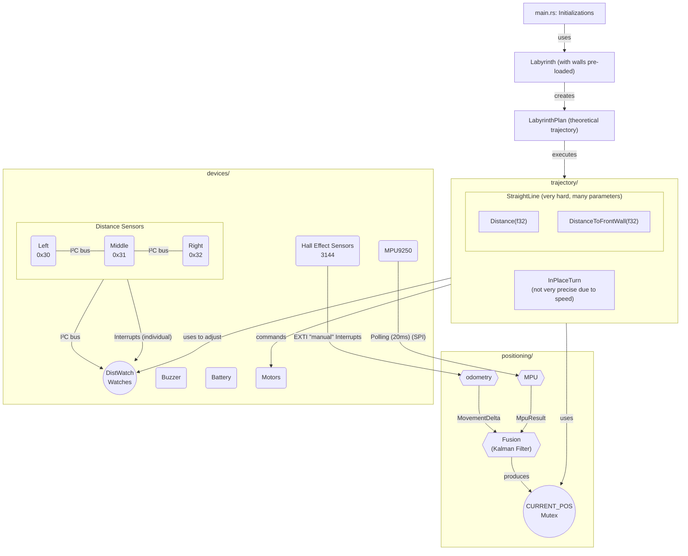

# Micromouse System Architecture: Technical Deep Dive

This document provides a comprehensive technical reference for the Micromouse firmware architecture. It details the task
structure, dataflows, mathematical models for sensor fusion, control loops, and tuning guidelines based on the current
state of the codebase.

## 1. System Overview & Data Flow Schema

The firmware is built on the Embassy asynchronous executor, operating on a "Latest State" model rather than a
queue-based one. This ensures that control loops always act on the freshest data without processing latency from
backlogged queues.

The following schema maps the entire system's data flow, from high-level maze planning to hardware control:



### Task Structure Summary

| Task            | Module                   | Purpose                                                       | Frequency   |
|:----------------|:-------------------------|:--------------------------------------------------------------|:------------|
| **Positioning** | `src/positioning/mod.rs` | Sensor fusion, odometry integration, and pose estimation.     | 20ms (50Hz) |
| **I2C/ToF**     | `src/i2c_devices.rs`     | Sequential polling of distance sensors (Left, Middle, Right). | ~15Hz       |
| **Maze Runner** | `src/main.rs`            | High-level strategy, path execution, and trajectory control.  | Async/Event |

## 2. Dataflows & Communication Mechanisms

The system uses three distinct communication patterns to manage data flow between producers (sensors) and consumers (
fusion/control loops).

### A. Atomic Counters (Odometry)

* **Source:** Hall sensor EXTI interrupts (`src/devices/hall_sensor_3144.rs`).
* **Mechanism:** `AtomicI32` counters (`LEFT_TICKS_TOTAL`, `RIGHT_TICKS_TOTAL`).
* **Flow:** The `positioning_task` calls `get_odom_delta()`, which uses `.swap(0, Ordering::Relaxed)` to atomically read
  and reset the accumulated pulse count every 20ms. This prevents missed ticks while avoiding the overhead of async
  channels.

### B. Watches (Distance Sensors)

* **Source:** VL53L1X sensors via I2C.
* **Mechanism:** `embassy_sync::watch::Watch` (`VL53L1X_MIDDLE_WATCH`, etc.).
* **Flow:** The I2C task publishes the latest `RangingMeasurementData` to a watch. Multiple consumers (like the
  `StraightLine` controller and future mapping logic) can subscribe to the latest value without consuming it or blocking
  the producer.

### C. Global Mutex/Cell (Position)

* **Source:** `SensorFusion` engine.
* **Mechanism:** `Mutex<CriticalSectionRawMutex, Cell<PositionState>>`.
* **Flow:** The `positioning_task` updates `CURRENT_POS` every 20ms. Any trajectory segment can retrieve the
  latest $[x, y, \theta]$ pose by calling `CURRENT_POS.get()`.

## 3. Coordinate System & Core Data Types

*Coordinate System Reminder:* The robot's mathematics strictly follows the standard Orthonormal Right-Hand Rule:

- `X` points Front (Forward / East).
- `Y` points Left (North).
- `Z` points Up.
- Positive rotation (`theta`) means spinning Counter-Clockwise (Turning Left).

*Note:* Because the MPU9250 IMU is mounted upside down, the firmware perfectly inverts the `Y` and `Z` axes *before* any
fusion math runs.

### `PositionState`

The global state of the robot in the orthonormal world frame.

```rust
pub struct PositionState {
    pub x: f32,         // meters
    pub y: f32,         // meters
    pub theta: f32,     // radians
    pub v_forward: f32, // local forward velocity (m/s)
    pub omega: f32,     // angular rate (rad/s)
}
```

### `MovementDelta`

The relative displacement calculated from odometry over a specific 20ms window.

```rust
pub struct MovementDelta {
    pub dx: f32,      // Local forward translation (meters)
    pub dy: f32,      // Local lateral translation (meters - geometric arc drift)
    pub d_theta: f32, // Change in heading (radians)
}
```

---

## 4. Positioning & Sensor Fusion (`fusion.rs`)

The robot uses **Decoupled Sequential Scalar Kalman Filters** rather than a standard Extended Kalman Filter (EKF).

### Why Decoupled Scalar Filters?

A full EKF maintains a $3 \times 3$ covariance matrix for $[x, y, \theta]$ and requires calculating Jacobian matrices to
propagate uncertainty through non-linear kinematic equations (like sine and cosine). On a Cortex-M4 microcontroller,
doing multi-dimensional matrix inversion is computationally expensive.
Instead, we "decouple" the filters. We maintain one 1D filter for Heading ($\theta$) and one 2D filter for
Position ($XY$). We statically resolve the non-linear trigonometry (`sin`/`cos`) first, convert the sensor inputs into
global linear coordinate frames, and *then* feed those projections into fast scalar Kalman algebra.

### The "Asynchronous Tick" Odometry Issue

Because the hall effect minimum resolution is low (12 ticks per revolution), driving in a straight line often triggers
the left and right wheel ticks completely out of phase. If tracked purely with odometry, this simulates the robot taking
microscopic "diagonal zig-zag" steps forward.
**How the Kalman Filter solves this:** The Kalman Filter evaluates probabilities. Because the MPU9250 Gyroscope
*simultaneously* reports that `0.0` degrees of rotation happened during that period, the filter compares the two. Since
our `r_theta_odom` (Wheel measurement noise) is significantly higher than our `q_theta` (Gyro process noise), the filter
**rejects** the false odometry rotation. The fake zig-zag is squashed mathematically, and only the forward `dx` momentum
survives.

### A. Heading Filter ($\theta$)

The heading $\theta$ is updated sequentially from three sources:

1. **Predict Step (Gyro):**
    - State: $\theta_{new} = \theta_{old} + \Delta\theta_{gyro}$
    - Covariance: $P_{\theta} = P_{\theta} + Q_{gyro}$
    - **Constraint:** $\Delta\theta_{gyro}$ is clamped at $\pm 0.70$ rad/step. Real physical motion cannot exceed this
      rate; anything larger is rejected as an electrical EMI spike from motor current transients.

2. **Update Step 1 (Odometry & Skid Steering Physics):**
    - Measurement Noise ($R$) scales dynamically with angular
      rate ($\omega$): $R_{odom} = R_{base} \cdot (1 + K_{skid} \cdot \omega^2)$.
    - **The Physics of Skid Steering:** The micromouse uses a differential drive. Differential drive robots rely on
      wheel slip (skid steering) to turn, especially at high speeds. When driving straight ($\omega \approx 0$), the
      wheels grip the floor perfectly. The encoder ticks accurately measure forward displacement and maintain a straight
      heading, so $R_{odom}$ is low (0.5), meaning odometry is highly trusted. However, when making a sharp
      turn ($\omega > 0$), lateral friction forces the wheels to slip sideways. The encoder ticks no longer correspond
      to pure mathematically calculable arcs, making the odometry heading calculation highly inaccurate.
    - By defining $R_{odom}$ as a function of angular velocity ($\omega^2$), the Kalman Filter natively models this
      physical limitation. As the robot turns faster, $R_{odom}$ dynamically spikes. This lowers the Kalman Gain for
      odometry, gracefully shifting trust entirely onto the Gyroscope to track the fast rotation.

3. **Update Step 2 (Magnetometer):**
    - Used for absolute heading to kill long-term gyro drift. $R_{mag}$ is set massively high ($1000.0$) because motor
      PWM drastically distorts the local magnetic field. This ensures the compass only steps in to gradually fight
      endless "long-walk" drifting over several minutes without corrupting sharp, active turns.

### B. Position Filter ($XY$)

1. **Velocity Estimation:** Forward velocity is derived using a **Tick-Count** method ($v = \Delta d_{odom} / \Delta t$)
   smoothed with an Exponential Moving Average ($\alpha=0.5$). This has bounded quantization noise and avoids the
   massive "aliasing spikes" that occur if you use inter-tick timestamps at only 12 ticks/rev.
2. **Predict Step:** Integrates velocity into global $X, Y$ coordinates based on the fused heading $\theta$.
3. **Update Step:** The filter corrects its integrated prediction against a parallel "Global Odometry" state, which
   prevents incremental floating-point integration errors from running away.

### Demystifying the Kalman Filter Math

Because we don't use matrices, the scary vector equations from standard Kalman theory simplify dramatically into basic
algebra:

**1. Predict Step:**

- *State Prediction*: $x = x + \Delta u$
- *Covariance Prediction*: $P = P + Q$

**2. Update Step:**

- *Innovation (Residual - $y$)*: $y = z - x$ (Where $z$ is the sensor measurement)
- *Innovation Covariance ($S$)*: $S = P + R$
- *Kalman Gain ($K$)*: $K = P / S$ (A ratio from 0.0 to 1.0 representing how much we should trust this measurement)
- *State Update*: $x = x + K \cdot y$
- *Covariance Update*: $P = (1 - K) \cdot P$

---

## 5. Straight-Line Control Logic (`straight_line.rs`)

The `StraightLine` trajectory segment handles acceleration, constant speed, precision braking, and corridor centering.

### A. Speed Control (PI Loop)

The robot uses a position-form PI controller:

- **$KP=0.5, KI=9.0$:** These values ensure rapid tracking of the target speed. The integral eliminates steady-state
  speed error caused by friction or battery voltage sag.
- **Anti-Windup:** The integral contribution is capped at `MAX_SPEED_M_S` to prevent massive overshoot if the motors
  temporarily stall or lose grip.
- **Deceleration Phase:** When entering the calculated deceleration braking ramp, the speed integral is immediately
  multiplied by `DECEL_I_FACTOR` (0.4). This quickly "sheds" the accumulated power needed for high-speed cruising,
  preventing the robot from blowing through the stop target.

### B. Wall Following & Steering

Steering is implemented as a multiplicative dimensionless correction: `L = speed * (1 - steer)`,
`R = speed * (1 + steer)`.

1. **Geometric Correction:**
    - The 45° Left and Right ToF sensors measure a diagonal distance. The controller converts this to an orthogonal
      lateral distance to the wall: $d_{ortho} = d_{raw} / \sqrt{2}$.
2. **Centering vs Avoidance:**
    - **Two Walls Visible:** The controller calculates the difference between Left and Right to find the center,
      targeting `PREFERRED_CLEARANCE`.
    - **One Wall Visible:** The controller switches to "avoidance" mode, targeting a tighter `LATERAL_CLEARANCE`. It
      only applies steering if the robot gets closer than this natural center, preventing the robot from blindly
      steering into open space when the opposing wall disappears.
3. **Predictive Damping:**
    - **$KD_{HEADING}=0.05$:** Damps the robot's angular rate ($\omega$) to prevent "fishtailing" and oscillation.
    - **$KD_{WALL}=0.2$:** An "approach-rate" gain. It uses a 3-sample ring buffer of ToF readings to calculate the rate
      at which the robot is laterally closing in on a wall ($m/s$). It applies a counter-steering force *before* the
      robot gets too close.

### C. Precision Stopping (`DistanceToFrontWall`)

When stopping at a front wall, the controller must overcome **Sensor Lag**:

- **Structural Lag:** The VL53L1X internal pipelining creates ~250ms of lag between physical reality and the I2C read.
- **Compensation:** When a ToF reading arrives, the robot subtracts $(v_{current} \cdot 0.250s)$ from the raw distance
  to estimate its *actual* physical position right now.
- **Encoder Extrapolation:** The ToF sensors only update every 66ms. To maintain a perfectly smooth 20ms deceleration PI
  ramp, the controller extrapolates the remaining distance using the wheel encoders (Odometry $\Delta dx$) between ToF
  readings. When the next fresh ToF reading arrives, it resets the target, effectively preventing encoder slip from
  compounding over long braking zones.

---

## 6. Physical Units and Tuning Guide

### Constants Reference

- **Acceleration:** $2.0 \, m/s^2$
- **Deceleration:** $2.5 \, m/s^2$ (Higher because motor braking and physical friction assist).
- **Max Speed:** $1.0 \, m/s$
- **Odometry Resolution:** 12 pulses per revolution, 12mm wheel radius, 78mm track width.

### Tuning the Fusion Engine

All properties involving rotation inside the `SensorFusion` structure are grounded in statistical variance ($rad^2$).

1. **Adjusting `Q_THETA_GYRO` (Currently $0.0001$):**
   If you execute long straight runs and notice the heading drifting away when you mathematically know you are going
   exactly straight, the MPU prediction is generating too much noise. *Action: INCREASE `Q`.* The filter will weigh the
   odometry measurements (which expect 0 straight rotation) more heavily.

2. **Adjusting `R_THETA_ODOM_STRAIGHT` (Currently $0.5$) and `SKID_K` (Currently $0.586$):**
   If the robot turns into a tight corner at maximum velocity, the wheels skid. By having $K_{skid}$ scale $R$
   with $\omega^2$, the filter natively handles this. If you change tires to something with much worse grip, *Action:
   INCREASE `SKID_K`* so the filter leans on the Gyro earlier in the turn.

3. **Adjusting `R_THETA_MAG` (Currently $1000.0$):**
   If you shield the magnetometer from motor PWM fields, you can radically *DECREASE* this to $0.5$. This would give the
   robot instant, absolute positional permanence. Until then, it stays high to prevent motor noise from ruining the
   Gyro's active tracking.

