# Build & Assembly Manual

## CAD models

[Onshape link](https://cad.onshape.com/documents/aaf7a6983651c7702bceaa13/w/41b76918edb6f00955c96fe0/e/62dd90809362918a445464ef?renderMode=0&uiState=6a1494e0c7839ab38c881d4a)

All parts (chassis, wheels, electronics mounts) were modeled in 3D in Onshape. Onshape is the
only part of the project not stored in this repository. To modify the design, **make a full copy**
of the Onshape document.

- The **chassis** is laser-cut from 3 mm wood and assembled with wood glue on the most stressed
  joints.
- The **wheels** are laser-cut acrylic (wood is not strong enough for the gear teeth).  
  Note: wheels are modeled as solid bodies in Onshape — use the **Kiri:Moto** plugin to slice
  them into 5 mm layers and export as SVG for the laser cutter.
- The **axles** are shoulder screws (the smooth unthreaded shoulder acts as the axle), screwed
  directly into the wooden chassis.
- The **small pinion gears** mounted directly on the motor shafts are metal (off-the-shelf).

---

## How to rebuild the wooden chassis

### A. Exporting the SVG for the laser cutter

1. In Onshape, go to the **"Châssis"** tab (bottom-left), then drag the **Rollback bar** in the
   left panel to sit just after **"Auto Layout"**.

   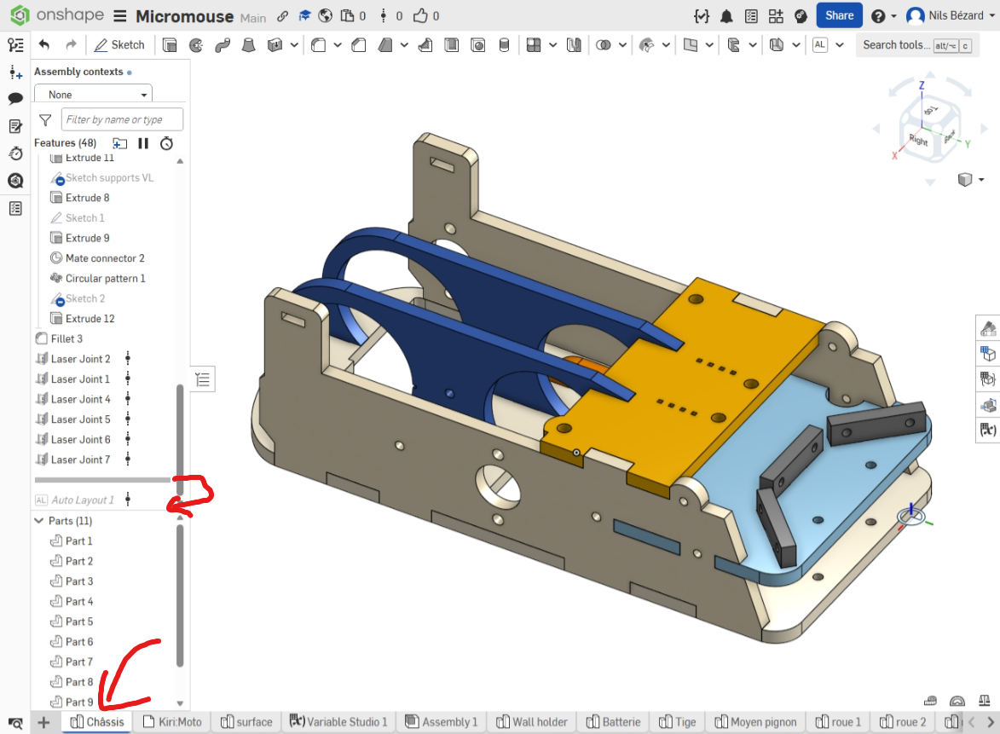

2. Open **Kiri:Moto** (bottom-left menu).

3. Close any open panels and **delete all existing parts** (importing directly into an existing
   session does not work reliably).

4. Go to **File → Import**, click the **Part Studio** icon, and import the chassis assembly
   (it will come in disassembled).

   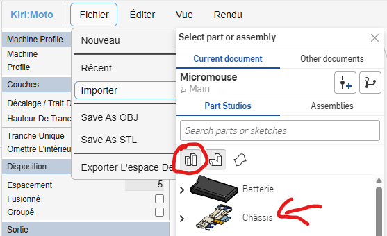

5. Set a **kerf compensation** (cut offset). A value of **0.16 mm** worked best.

6. Export as **SVG**.

7. The exported SVG has a known issue: arcs and circles are approximated as many closely-spaced
   line segments, causing the laser to dwell too long in one spot and char the wood.
   To fix this:

   a. Run `tools/clean_svg.py` from the repo — it replaces fake circles (many short segments)
   with proper SVG `<circle>` elements.

   b. In **Inkscape**: select all, convert to paths with `Ctrl+Maj+C`, switch to the Node tool
   (`N`), then use **Simplify Path** (`Ctrl+L`). Simplification threshold can be tuned in
   Inkscape's preferences.

8. Send the cleaned SVG to a laser cutter at a Fablab.

For the **wheels** (Onshape tab "roue 2"): no Auto Layout needed, but export via Kiri:Moto as
5 mm slices and apply the same SVG cleanup steps above.

---

### B. Assembly

Follow these steps in order. Do not skip ahead — some parts become inaccessible once the
next step is complete.

**1. Insert the motors (with wires already soldered) into the center motor mounts.**  
Note the orientation: motors are wider on one side, and the mounts match.

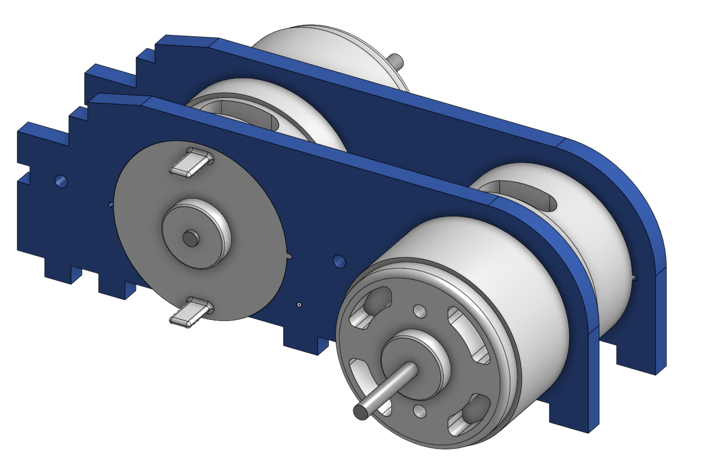

**2. Insert the motor assembly into the base plate.**

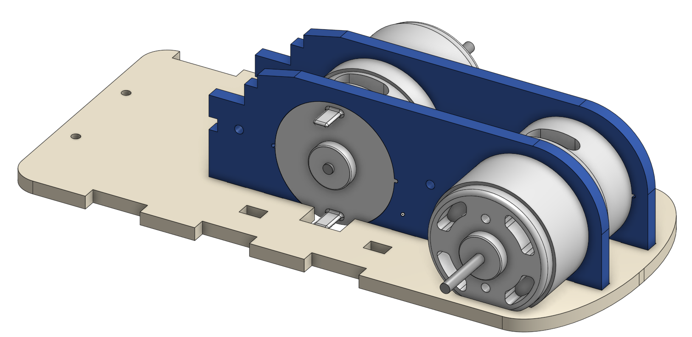

**3. Attach the light-blue front piece *before* any further assembly — it cannot be fitted later.**

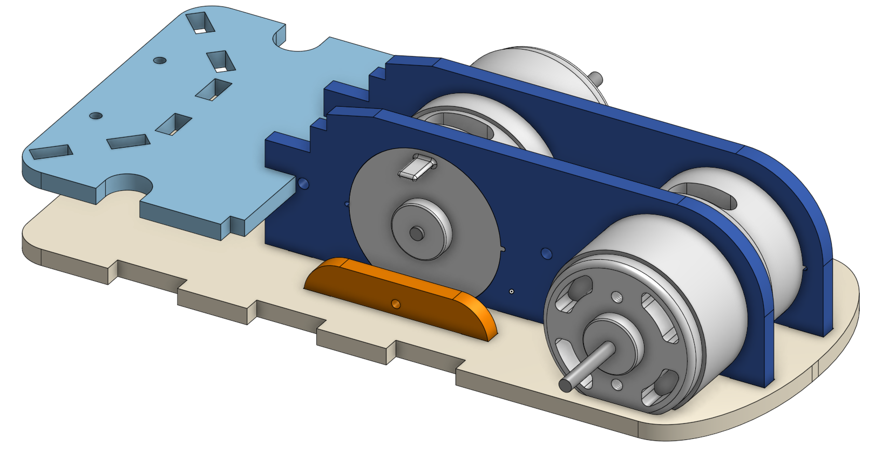

**4. Attach the side panels and the Pololu distance-sensor mounts.**

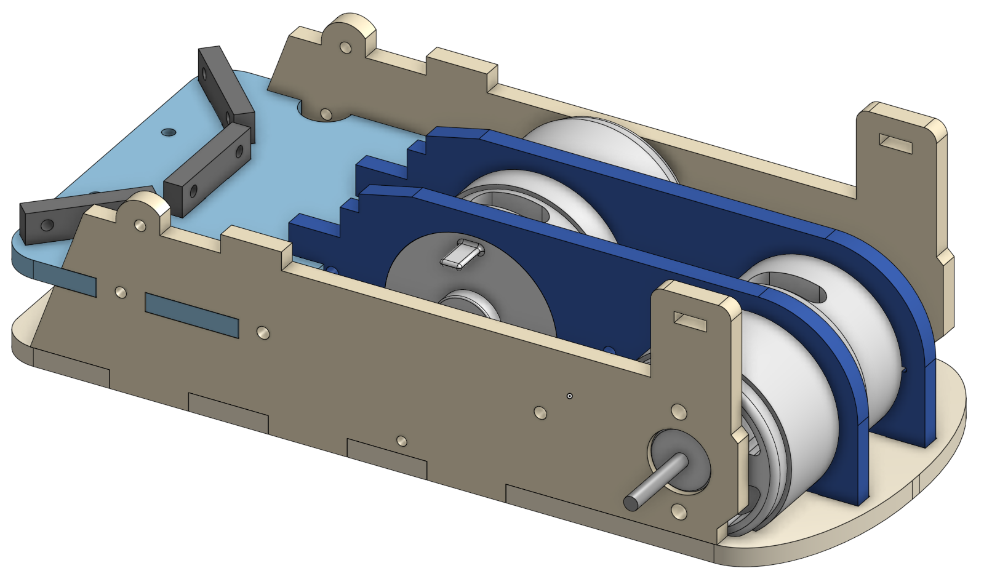

**5. Attach the SparkFun MPU-9250 mount.**

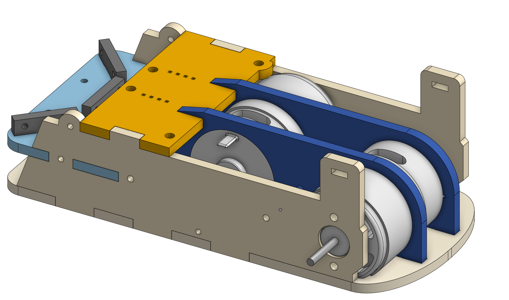

**6. Add the drive gear and the screws on the motor (repeat on both sides).**  
Note: the drive gear is fixed as close as possible to the chassis to gain a few millimeters.

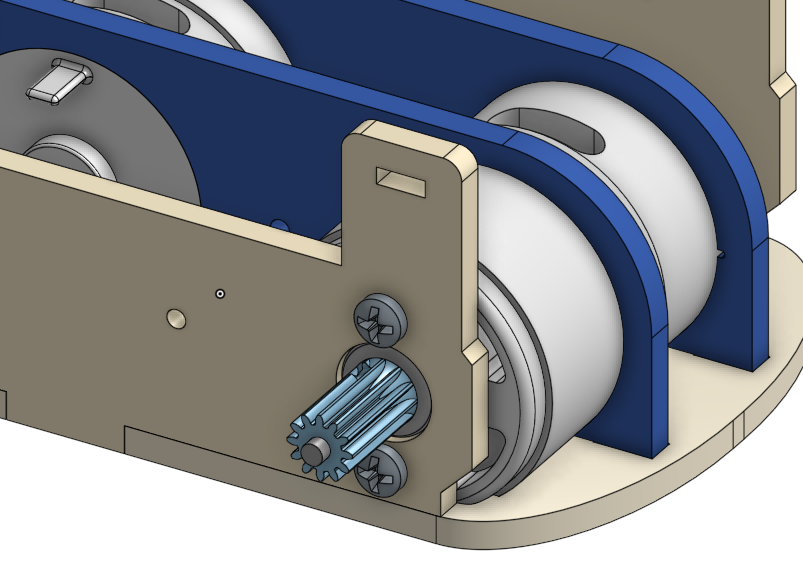

**7. Install the distance sensors and battery** (the battery can optionally be secured with a
screw at the front).

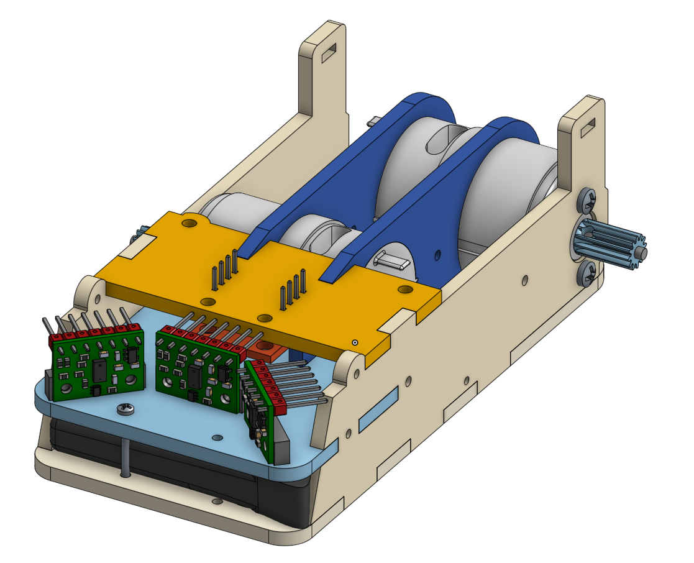

**8. Mount the Nucleo board** using screws through the two front holes.  
Note: the right-hand screw has very little clearance under it — stack several washers to raise it to the
correct height if your screw is too long.

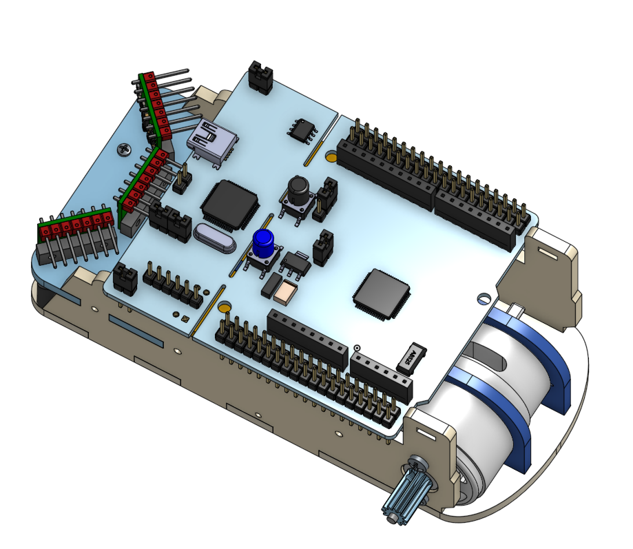

**9. Fix the Nucleo board with the custom rear PCB**, it screws into the Nucleo (add a nut underneath).  
The chassis' wood must be bended slightly to slide the PCB into position. If the wood doesn't flex enough,
you might want to change the assembly order

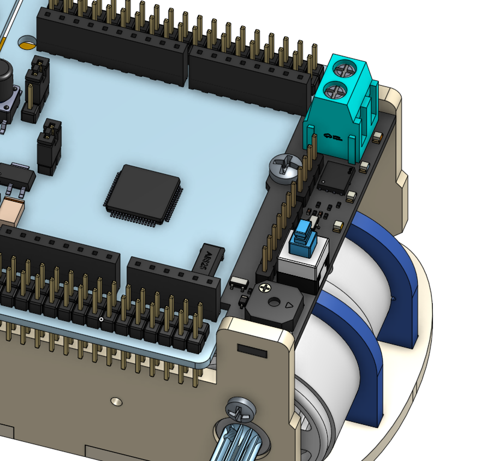

**10. Mount the motor driver board.**

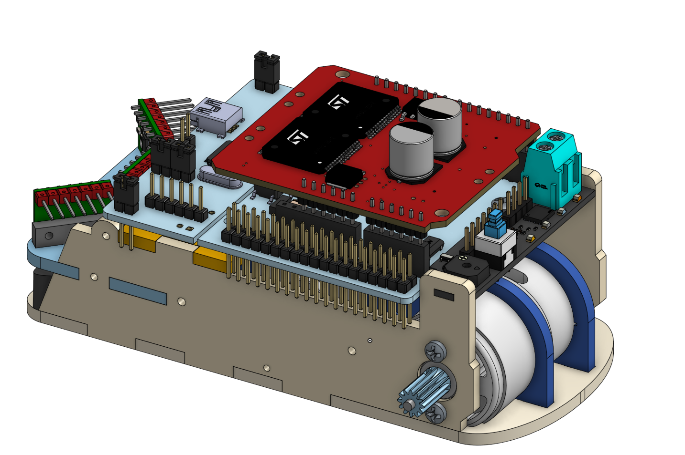

**11. Laser-cut the flat wheel discs from acrylic.**  
Either cut two 5 mm slices and superglue them together, or cut a single 10 mm piece.

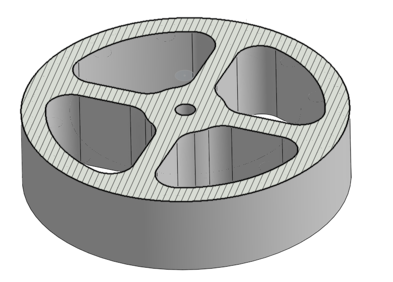

**12. Laser-cut the toothed gear rings** (two wheels need the 12 holes for the encoder magnets)
and superglue them to the flat discs. Alignment must be perfect. Also cut the middle pinion (second picture) which
is 5mm thick.

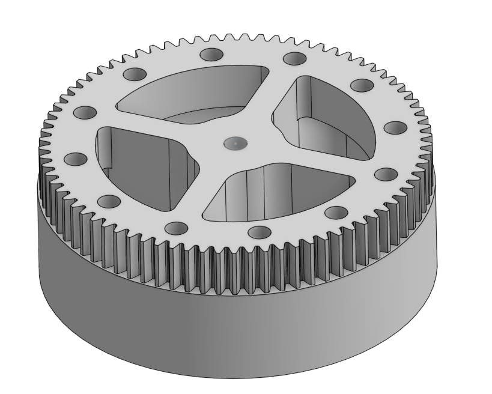 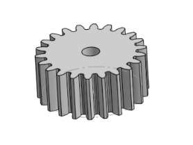

**13. Make the axle assemblies.**  
Find long screws with a long unthreaded shoulder to use as axles. Insert the screw through the
wheel with the head on the side *without* the gear. Add two or three small washers, then solder
them to the screw to prevent axial movement while still allowing rotation. Do the same for the
idler pinion. Then screw the complete wheel assemblies into the chassis.

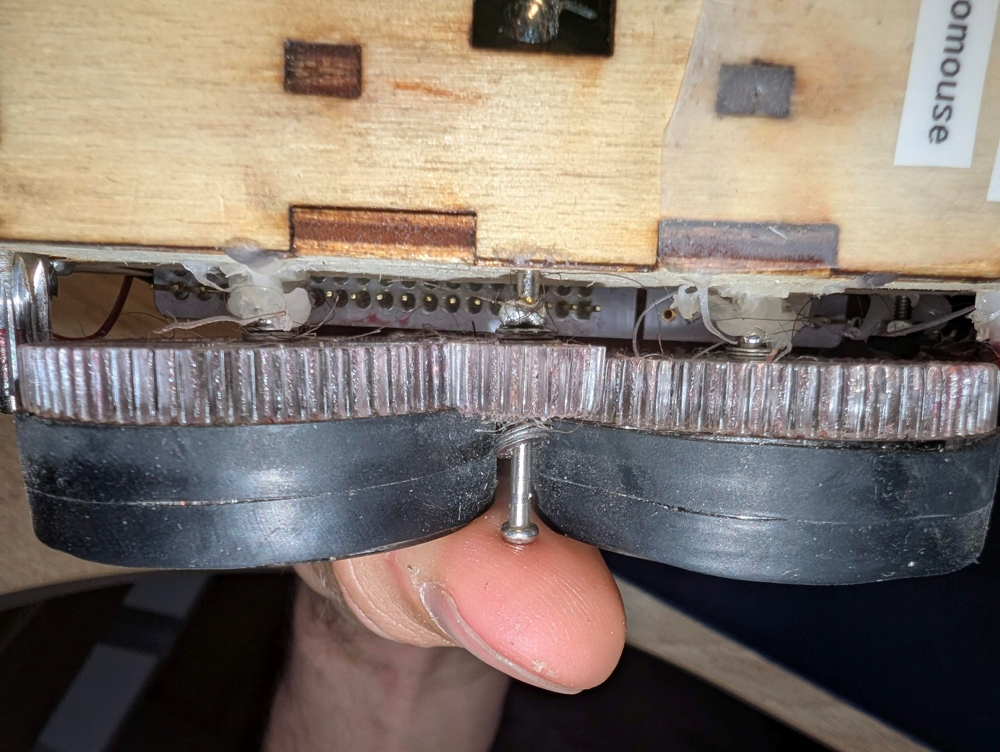

> A small amount of hot glue between the screw shafts and the chassis adds resistance to shocks.

**14. Mount the Hall-effect sensors** as close as possible to the wheel gear ring, secured with
screws, nuts, and hot glue.

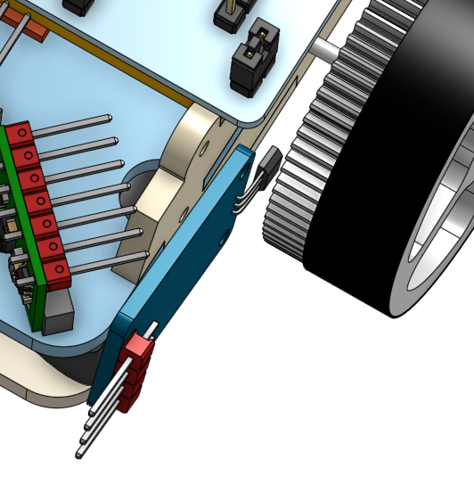

**15. Done ! Apply a little grease to the gears for less friction.**

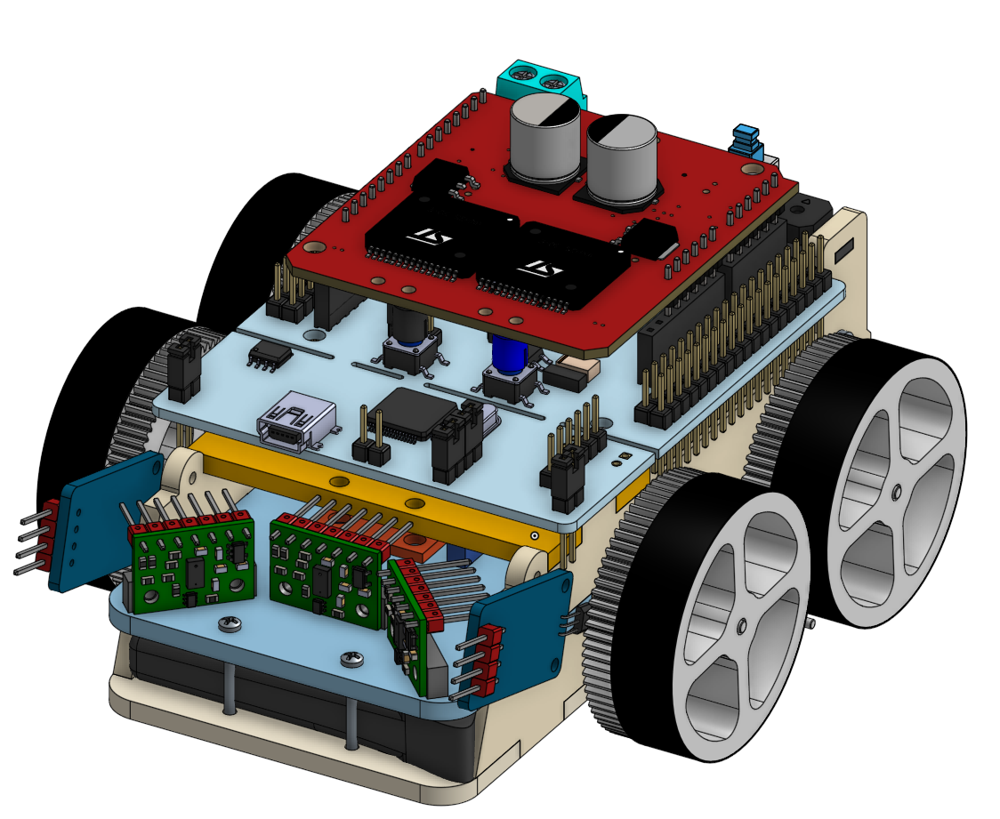
