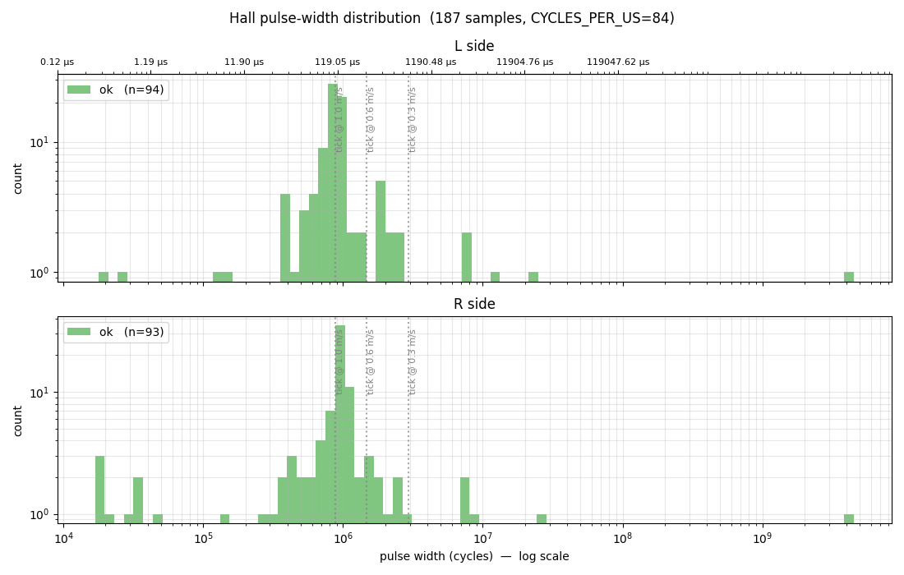

# Issues encountered and solutions found

## The VL53L1X Rust driver

I started the project trying to get the distance sensors working (not knowing that they would
be the last thing I would need, since wall-following and stopping at a given distance from a
wall were only implemented at the very end). I started by reading STMicro's official datasheet
for this sensor, which provided a C driver. However, including C code in such a project is a
hassle, so I tried to translate the driver to Rust with the help of AI — which almost worked,
but a few bugs persisted. This was a big mistake, especially since this translation had already
been done [here](https://github.com/mitchmindtree/vl53l1). A simple Google search with the
right keywords would have been enough.

## Debugging

Debugging on a microcontroller is harder than debugging on a PC, made worse by the fact that
GDB debugging doesn't work — I opened [an issue on GitHub](https://github.com/probe-rs/probe-rs/issues/3805)
about it, which was still being discussed when I wrote these lines. The slightly clunky solution
I found was to use DAP (Debug Adapter Protocol) instead of GDB, as explained in README.md.

In the end, it is often simpler to skip the debugger and rely on logs. To have logs even when
the robot is not connected to a PC, Claude built a `flash_log` module that saves logs to the
last sector of flash memory (see `memory.x`) so they can be viewed on the next boot when the
robot is plugged in via USB.

## I²C communication issues

The I²C communication bus was the source of many problems.

- **Blocking communications:** In Embassy, tasks must be scheduled using async/await. However,
  the libraries use the blocking version of I²C communication. I tried to adapt the VL53L0X
  and VL53L1X drivers to use the async I²C module, which failed as it was too complex. The
  communications are therefore blocking and account for roughly **5% of wasted CPU time** in
  total.

- **Async I²C deadlock:** This issue is documented in the code and references
  [this issue](https://github.com/embassy-rs/embassy/issues/2372) on which I documented my
  instance of the problem.

- **Frequent crashes:** Using a single distance sensor works fine. But with two or more sensors,
  some communications are imperfect and crash the microcontroller's I²C module. This module
  enters a deadlock state that is quite tricky to recover from. A C version of this problem was
  discussed [on the STMicro forum](https://community.st.com/t5/stm32-mcus-products/recovering-from-a-failed-i2c-transfer/td-p/97282)
  without a solution. Fortunately, Claude found a solution through direct register manipulation —
  see the `i2c_swrst_recovery` function. For more details, see
  [vl53l1x_i2c_bsy_lockup_recovery.md](vl53l1x_i2c_bsy_lockup_recovery.md).

- **[PR to change I²C addresses](https://github.com/dothanhtrung/vl53l1/pull/2):** To use multiple sensors on the same
  bus, each sensor must have
  a unique I²C address, requiring address reassignment at startup. The Rust `vl53l1` library did
  not support this feature, so Claude and I added it in my fork of that library.

## MPU in SPI mode

SPI is significantly more stable and faster than I²C, mainly due to the push-pull pin mode that
forces the line to VDDIO (3.3 V) in HIGH state instead of letting the pin "float" (which
requires pull-up resistors — visible on the left VL53L1X sensor, not present in the photo in
README.md). I therefore wanted to use SPI rather than I²C; however, as indicated in
[the documentation](https://learn.sparkfun.com/tutorials/mpu-9250-hookup-guide/all), soldering
jumper SJ2 must be desoldered and resoldered differently, which was quite difficult and damaged
the PCB. It is therefore impossible to switch this PCB back to I²C mode.

## Trajectory via point list

The first iteration of the trajectory module used a PathPoint system: a list of time-stamped
points spaced 20 ms apart was generated:


This allowed direct inclusion of optimizations such as rounded corners, but it did not work at
all: the robot is simply not capable of following such a precise trajectory, and trying to reach
each point at the given time led to motor commands that were far too abrupt.

## Tick counting for odometry

To count ticks from the Hall-effect sensors, I initially used Embassy's async
`ExtiInput::wait_for_falling_edge()` in a loop. This caused roughly **40% of ticks** to be
silently dropped at moderate speeds (~0.5 m/s): Embassy disarms the interrupt after each edge
and only re-arms it when `await` resumes, making any tick arriving in between invisible to the
hardware. The fix was to replace this with a raw, always-armed interrupt handler
(`cortex_m_rt::interrupt`) that increments an `AtomicI32` directly on each edge without going
through Embassy. For more details, see
[embassy_exti_missed_ticks_fix.md](embassy_exti_missed_ticks_fix.md).

However, after this change a new problem appeared: too many ticks were being counted due to
**phantom ticks**, most likely caused by electrical noise on the Hall sensor signal lines. By
logging inter-pulse durations with the `flash_log` module, it became clear that while the
majority of pulses cluster around the expected tick period for the current speed, some pulses
have completely aberrant durations (a few microseconds) — far too short to correspond to any
real magnet passing the sensor.



These phantom ticks had to be filtered out.

## Control loop (PI)

I spent the last month of this project (during exams) trying to implement the entire "automatic"
side: PI controller, wall following, etc. I had never done this before, and it turned out to be
far more complex than expected. Claude helped a lot, but I think a teacher or someone with a
control theory background could have guided me better. In the end, I more or less managed to get
the robot to navigate the "border" of the maze with walls arranged like this:

```
┌───────┐
│  ┌─┐  │
│  │ │  │
│  └─┘  │
└───────┘
```

I then tried to get the robot to solve a more complex maze on the day of the presentation, but
it failed (the robot hit every wall). I don't think the problem would have been hard to fix, but
I simply ran out of time. The code I added for solving more complex mazes broke the code that
could handle the simple border layout above.
